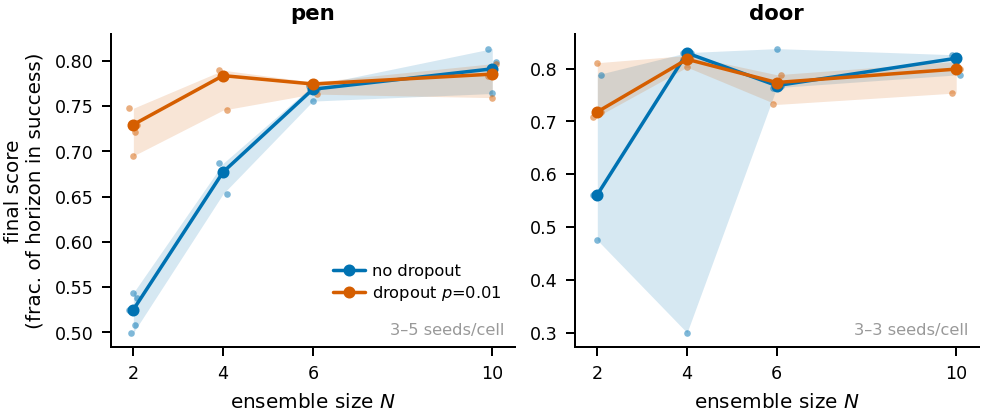

# Beyond Pessimism and Diversity

**What Critic Ensembles Regularize in Offline-to-Online RL**

Bowen Zhao and Zhuoyu Peng · Washington University in St. Louis

Code, archived experiment logs, and the analysis pipeline for the accompanying
[manuscript](paper/main.tex). The study examines how critic ensemble size, dropout,
and target pessimism relate to performance and action-space sharpness in
[RLPD](https://github.com/ikostrikov/rlpd). It includes 86 main/TPS runs on sparse
Adroit pen and door tasks, plus nine supplementary on-policy probe runs.

[Reproduce the analysis](#reproduce-the-analysis) · [Training](docs/training.md) ·
[Data provenance](data/README.md) · [Analysis methods](analysis/README.md) ·
[Contributing](CONTRIBUTING.md)

## Reproduce the analysis

The archived logs are included. Analysis needs no GPU, MuJoCo, datasets download,
cluster access, or tracking-service account. Use **Python 3.11**; the release was
checked with Python 3.11.7.

```bash
git clone https://github.com/bowenzhaosh/rlpd-ensemble-sensitivity.git
cd rlpd-ensemble-sensitivity
python3.11 -m venv .venv
source .venv/bin/activate
python -m pip install -r analysis/requirements.txt

# Validate the archived inputs, including the supplementary runs and hashes.
python analysis/validate_data.py --onpolicy --checksums

# Rebuild tables and figures without LaTeX.
bash analysis/run_all.sh --no-pdf
```

To also compile the manuscript, install LaTeX with `latexmk` and run:

```bash
bash analysis/run_all.sh
# -> paper/build/main.pdf
```

The default uses local data. `--local` remains an alias for that behavior.
`RLPD_PY=/path/to/python` selects another interpreter; `--sync` explicitly fetches
cluster logs first. See [training and cluster instructions](docs/training.md).

The pipeline validates manifest membership, complete evaluation/probe coverage,
finite values, and agreement between raw evaluations and summary scores before
writing artifacts. It regenerates:

- `analysis/out/tidy/`: run summaries, time series, prospective statistics, and fleet status.
- `paper/figures/`: seven figures and the README preview.
- `paper/tables/`: result tables and inline result macros.

The committed tables, tidy data, and figure PDFs matched a clean rebuild in the
tested environment. PDF bytes can vary with platform, fonts, and rendering
libraries. Historical replication uses the curated April tracker, whose raw logs
are not included. See [reproducibility limits](docs/training.md#reproducibility-limits)
before attempting training reruns.

## Results and scope



Final score is the fraction of the evaluation horizon spent in success, averaged
over the last ten evaluations of a 1M-step run. Entries below are seed medians
(min–max; number of seeds); target subset size *M* = 2 unless specified.

| Task | Ensemble *N* | No dropout | Dropout *p* = 0.01 | Difference of medians |
|---|---:|---|---|---:|
| pen | 2 | 0.53 (0.50–0.54; n=5) | 0.73 (0.70–0.75; n=5) | +0.20 |
| pen | 4 | 0.68 (0.65–0.69; n=3) | 0.78 (0.75–0.79; n=3) | +0.11 |
| pen | 6 | 0.77 (0.76–0.77; n=3) | 0.77 (0.76–0.78; n=3) | +0.01 |
| pen | 10 | 0.79 (0.76–0.81; n=5) | 0.79 (0.76–0.80; n=5) | −0.01 |
| pen (*M* = 1) | 2 | 0.00 (0.00–0.01; n=3) | 0.60 (0.60–0.62; n=3) | +0.60 |
| door | 2 | 0.56 (0.48–0.79; n=3) | 0.72 (0.71–0.81; n=3) | +0.16 |
| door | 4 | 0.83 (0.30–0.83; n=3) | 0.82 (0.80–0.82; n=3) | −0.01 |
| door | 6 | 0.77 (0.76–0.84; n=3) | 0.77 (0.73–0.79; n=3) | +0.01 |
| door | 10 | 0.82 (0.79–0.83; n=3) | 0.80 (0.75–0.81; n=3) | −0.02 |

The reported dropout benefit is largest at small ensembles. The target-policy
smoothing intervention is inconclusive, and the sharpness correlations do not
establish a causal mechanism or a validated model-selection rule. The additional
single-seed on-policy probe is excluded from the manuscript's headline claims;
its [analysis record](data/onpolicy-202606/VERDICT.md) explains the confounds.

The analysis plan was recorded when 12 of 62 grid runs were complete and before
TPS runs began. Subsequent changes to the statistical analysis are disclosed in
[analysis/README.md](analysis/README.md).

## Repository map

| Path | Purpose |
|---|---|
| `train_abc.py`, `train_abc_tps.py` | Grid and target-policy-smoothing training entrypoints |
| `sac_learner_v2*.py`, `diagnostic.py`, `configs/` | Critic ensemble, diagnostics, and configurations |
| `washu_runs*.txt`, `washu_*.sbatch` | Released experiment manifests and site-specific launchers |
| `analysis/` | Input validation, statistics, tables, and figures |
| `data/` | Archived results, provenance, and input checksums |
| `paper/` | Manuscript, bibliography, and generated artifacts |
| `tests/`, `.github/workflows/ci.yml` | Regression tests and reproducibility checks |

The April launchers (`run.sh`, `submit_all.sh`, `experiments.txt`,
`check_progress.sh`, `train_diagnostic.py`) remain for historical reference.
The superseded spectral-normalization code is on
[`spectral-norm-probe`](https://github.com/bowenzhaosh/rlpd-ensemble-sensitivity/tree/spectral-norm-probe).

## Citation

[CITATION.cff](CITATION.cff) provides machine-readable software metadata. For the
accompanying manuscript:

```bibtex
@misc{zhao2026beyondpessimism,
  title  = {Beyond Pessimism and Diversity: What Critic Ensembles Regularize in Offline-to-Online RL},
  author = {Zhao, Bowen and Peng, Zhuoyu},
  year   = {2026},
  note   = {Manuscript and code},
  url    = {https://github.com/bowenzhaosh/rlpd-ensemble-sensitivity}
}
```

## License and acknowledgements

Experiment and analysis code is released under the [MIT License](LICENSE).
The agent, configurations, and training scripts derive from
[ikostrikov/rlpd](https://github.com/ikostrikov/rlpd); its copyright notice is
preserved in [LICENSE-rlpd](LICENSE-rlpd). The conference style file and external
environments and datasets retain their own licenses. June compute was provided
by Washington University in St. Louis's Engineering IT GPU pool.
